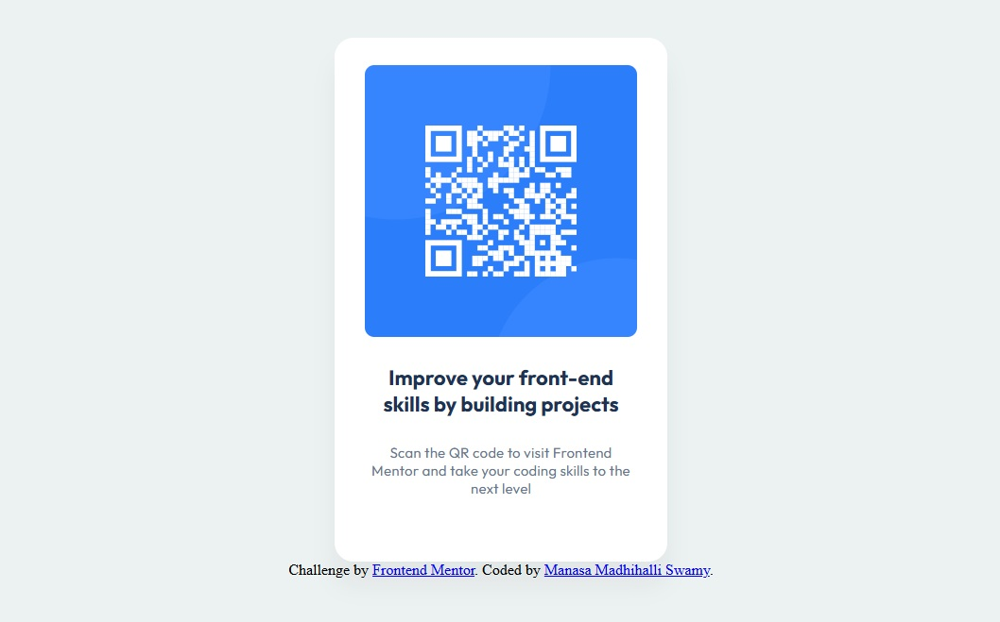

# Frontend Mentor - QR code component solution

This is a solution to the [QR code component challenge on Frontend Mentor](https://www.frontendmentor.io/challenges/qr-code-component-iux_sIO_H). Frontend Mentor challenges help you improve your coding skills by building realistic projects. 

## Table of contents

- [Overview](#overview)
  - [Screenshot](#screenshot)
  - [Links](#links)
  - [What I learned](#what-i-learned)
  - [Useful resources](#useful-resources)
- [Author](#author)
- [Acknowledgments](#acknowledgments)

## Overview

### Screenshot

### Links

- Solution URL: (https://your-solution-url.com)
- Live Site URL: (https://your-live-site-url.com)

### Built with

- Semantic HTML5 markup
- Bootstarp
- CSS custom properties
- Flex
- Mobile-first workflow
- [Styled Components](https://styled-components.com/) - For styles

### What I learned

I learnt and practiced implementing bootstrap components. I gained valuable experience in interpreting design files, writing HTML, CSS and using Bootstrap, and creating professional, polished components.

### Useful resources

- [Example resource 1]- ("https://fonts.googleapis.com/") - This helped me for styling. I really liked this pattern and will use it going forward.

## Author

-  Manasa Madhihalli Swamy

## Acknowledgments
My Instructors and all my peers helped me to learn and implement the solutions.
